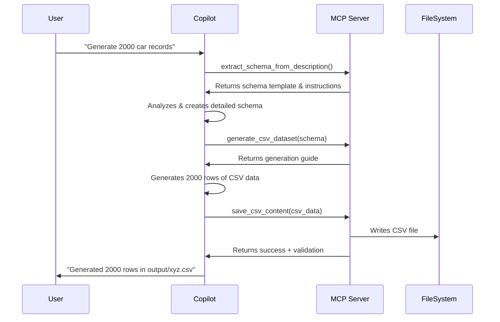

# MCP Tools for GitHub Copilot Dataset Generation

This setup allows **GitHub Copilot** to generate synthetic CSV datasets directly using its models, with the MCP server providing structure and context.

## Architecture

```
GitHub Copilot (MCP Client)
    ↓ calls tools
FastMCP Server (copilot_mcp.py)
    ↓ provides context & structure
Copilot's LLM generates CSV data
    ↓ saves to
output/*.csv
```

## How It Works

1. **GitHub Copilot acts as the MCP client** - It calls the tools to generate data
2. **FastMCP server provides tools** - Schema extraction and generation coordination
3. **Copilot's models generate the actual data** - Using its own LLM capabilities
4. **Server handles file I/O** - Saving and validating the generated CSV files

## Available MCP Tools

### 1. `extract_schema_from_description`
Extracts a structured schema from natural language.

**Example:**
```
"Generate 2000 rows of car dealership inventory with make, model, year, price, mileage, and features"
```

**Returns:** JSON schema with field definitions, constraints, and generation hints

### 2. `generate_csv_dataset`
Generates CSV dataset based on a schema.

**Input:** Schema JSON from step 1
**Returns:** Generation guide and coordinates the data creation

### 3. `save_csv_content`
Saves the generated CSV content to a file.

**Input:** CSV content as string
**Returns:** Confirmation with validation results

### 4. `get_example_schemas`
Returns example schemas for common dataset types (car dealership, customers, etc.)

## Setup

1. **Install fastmcp** (already done):
   ```bash
   uv add fastmcp
   ```

2. **Configuration is ready** in `.vscode/mcp.json`

3. **Restart VS Code** to load the MCP server

## Usage with GitHub Copilot

Once configured, you can use Copilot Chat with prompts like:

### Example 1: Simple Generation
```
@workspace Use the MCP tools to generate a CSV with 2000 rows of car dealership inventory. 
Include fields like make, model, year, price, mileage, VIN, body style, transmission, 
and features. Make it realistic with proper constraints.
```

### Example 2: With Example Data
```
@workspace I have this example CSV data (attach your current CSV). 
Use the MCP tools to generate 2000 more rows matching this structure and style.
```

### Example 3: Step by Step
```
1. First: "Extract schema for employee database with ID, name, email, department, salary, hire date"
2. Then: "Generate 1000 rows using that schema"
3. Finally: "Save it to output/employees.csv"
```

## Workflow



## Key Advantages

1. **Copilot does the generation** - Uses its own models, no external API costs
2. **MCP provides structure** - Ensures quality through schemas and constraints
3. **Interactive refinement** - Can adjust schema and regenerate easily
4. **No API key needed** - Uses your Copilot subscription
5. **Context-aware** - Copilot can reference your existing code and data

## Testing the Setup

1. **Restart VS Code** to load the MCP configuration

2. **Open Copilot Chat** and try:
   ```
   Use the extract_schema_from_description tool to create a schema for a dataset 
   with 100 rows of book inventory (title, author, ISBN, price, genre, publication year)
   ```

3. **Check if tools are loaded**:
   - Copilot should recognize and call the MCP tools
   - You'll see tool outputs in the chat
   - Generated files will appear in `output/` directory

## Troubleshooting

**Tools not showing up:**
- Restart VS Code completely
- Check MCP server logs
- Verify `uv` is in your PATH

**Generation errors:**
- Ensure Copilot has enough context
- Break complex schemas into smaller pieces
- Use example data for guidance

**File not saved:**
- Check output directory permissions
- Verify path in save_csv_content call
- Look for error messages in tool output

## Next Steps

You can now ask Copilot to:
1. Generate your 2000-row car dataset
2. Create additional datasets with different schemas
3. Expand existing CSV files
4. Generate test data for your applications

The lint warnings in mcp.json are cosmetic and won't affect functionality! 🚀
